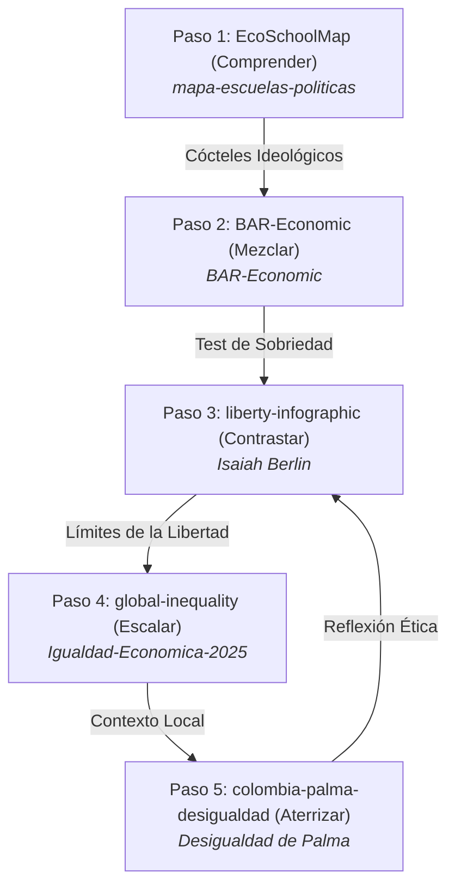

# 🗺️ Mapa de Escuelas Políticas Económicas · Paso 1

### *Visualización interactiva y scrollytelling de las 12 escuelas de pensamiento económico en un plano bidimensional.*
### *An interactive scrollytelling visualization of 12 economic schools of thought in a 2D space.*

---

[](https://willkwolf.github.io/EcoSchoolMap/)
[](https://github.com/willkwolf/EcoSchoolMap)
[](https://creativecommons.org/licenses/by-sa/4.0/)
[](https://d3js.org/)

---

## 🌐 Demo en Vivo / Live Demo
**👉 [Ver en vivo en GitHub Pages](https://willkwolf.github.io/EcoSchoolMap/)**

---

## 🧭 La Ruta del Pensamiento Crítico (El Ecosistema)
Este proyecto forma parte de **"La Ruta del Pensamiento Crítico"**, una red interactiva de 5 webs estáticas de `@willkwolf` que conectan teoría económica, dilemas políticos, brechas materiales y contextos locales.



> [!NOTE]
> **Estás en el Paso 1: Comprender**. Aquí mapeamos la base teórica y descriptores de 12 escuelas de pensamiento para estructurar tu caja de herramientas conceptual. Al final de la página, un banner te invitará a mezclar estos conocimientos teóricos en el **Paso 2: El Bar de Cocteles Económicos**.

---

## 🔍 Contexto Temático / Philosophical Context

El proyecto se fundamenta en la premisa metodológica de **Ha-Joon Chang** (*Economics: The User's Guide*, 2015): no existe una sola verdad absoluta en economía. El pensamiento económico no debe enseñarse como una doctrina monolítica, sino como un diálogo dinámico entre múltiples marcos teóricos en competencia. 

Cada escuela posee una **Weltanschauung** (visión del mundo) única que determina sus prioridades analíticas y sus prescripciones políticas. Este mapa las sitúa en un plano 2D continuo basado en dos tensiones fundamentales:
1. **Eje X (Arquitectura Económica):** Coordinación colectiva y regulación del Estado frente al libre funcionamiento de los mercados auto-regulados.
2. **Eje Y (Objetivo Socioeconómico):** Búsqueda directa de la equidad distributiva y bienestar social frente a la primacía del crecimiento y acumulación de capital.

---

## 🤓 Para el Lector más Nerd / Ficha Técnica (Deep Tech Insights)

### Los 6 Descriptores Fundamentales (Core scoring)
Cada posición `(X, Y)` se calcula a partir de un sistema de scoring cualitativo compuesto por **6 descriptores normalizados** de la visión de cada escuela:

1. **Concepción de la Economía (`concepcion_economia`):**
   * `0.0` = **Individuos** (metodología individualista / neoclásica)
   * `0.5` = **Estructuras** (instituciones, mercados institucionales)
   * `1.0` = **Clases Sociales** (conflicto de clases o poder estructural)
2. **Concepción del Ser Humano (`concepcion_humano`):**
   * `0.0` = **Racional Egoísta** (homo economicus auto-interesado)
   * `1.0` = **Racionalidad Limitada** / Condicionado por Clase y Sociedad
3. **Naturaleza del Mundo (`naturaleza_mundo`):**
   * `0.0` = **Cierto y Predecible** (foco en equilibrio de largo plazo)
   * `1.0` = **Complejo e Incierto** (cambio histórico y contingencia)
4. **Ámbito Económico Principal (`ambito_economico`):**
   * `0.0` = **Producción** (oferta, tecnología)
   * `0.33` = **Consumo** (demanda agregada)
   * `0.67` = **Comercio** (intercambio de mercados)
   * `1.0` = **Distribución** (desigualdad y redistribución)
5. **Motor del Cambio Económico (`motor_cambio`):**
   * `0.0` = **Acumulación de Capital** | `0.25` = **Decisiones Individuales** | `0.5` = **Innovación** | `0.75` = **Instituciones** | `1.0` = **Lucha de Clases**
6. **Políticas Preferidas (`politicas_preferidas`):**
   * `0.0` = **Libre Mercado** (laissez-faire) | `0.5` = **Mixtas/Reguladas** | `1.0` = **Intervención Estatal / Planificación**

### Fórmulas de Mapeo Continuo
Los descriptores cualitativos se multiplican por **pesos configurables** según el enfoque analítico elegido por el usuario (Presets):

$$\text{Posición X} = f(\text{políticas\_preferidas}, \text{motor\_cambio}, \text{concepción\_economia})$$
$$\text{Posición Y} = f(\text{ámbito\_economico}, \text{concepción\_humano}, \text{naturaleza\_mundo})$$

### Métodos de Normalización de Datos
El script de backend en Python (`scripts/scoring_methodology.py`) recalcula las posiciones aplicando una de cuatro técnicas en tiempo real, lo que permite evaluar el impacto metodológico:
* **Percentil (Uniforme):** Distribuye uniformemente las escuelas entre `[0, 100]%` (por defecto en el visualizador interactivo D3).
* **Z-score (Estadístico):** Centra la media en 0 y mide las desviaciones estándar ($\sigma$).
* **MinMax:** Estira el rango completo para ocupar la pantalla.
* **None:** Muestra los valores crudos derivados directamente de la teoría.

### El Esquema Klein-Schema
La visualización utiliza la refinada **Klein Palette** de 11 colores únicos para garantizar la máxima legibilidad visual sin repetición cromática de nodos.

---

## 🛠️ Stack Tecnológico

### Frontend (Visualización interactiva)
* **D3.js (v7.9.0):** Biblioteca principal de dibujo SVG reactivo de datos.
* **GSAP (v3.13.0):** Sistema de animaciones fluidas y transiciones históricas.
* **Vite (v7.2.2):** Herramienta de compilación ultrarrápida y servidor HMR.
* **Sass (v1.94.0):** Estructura modular de estilos responsivos.
* **save-svg-as-png (v1.4.17):** Biblioteca para exportación directa PNG.

### Backend (Data Pipeline & Análisis)
* **Python 3.11+:** Lenguaje base para el tratamiento estadístico.
* **NumPy (v2.1.3) & SciPy (v1.15.3):** Cálculos estadísticos y cálculo de percentiles.
* **Pandas (v2.2.3):** Modelación matricial y descriptores.
* **Matplotlib (v3.10.0):** Generador de gráficos de paper estáticos en PNG de alta resolución (300 y 600 DPI).

---

## 📦 Instalación y Uso Local

### Requisitos
* **Node.js** 18+ (para el visualizador interactivo)
* **Python** 3.11+ (opcional, para regenerar el backend de datos)

### Frontend (Servidor de Desarrollo)
```bash
# 1. Clonar repositorio
git clone https://github.com/willkwolf/EcoSchoolMap.git
cd EcoSchoolMap

# 2. Instalar dependencias
npm install

# 3. Lanzar servidor de desarrollo local
npm run dev
# -> Visita http://localhost:3000
```

### Backend (Python Pipeline)
Recomendamos usar el gestor ultrarrápido **UV**:
```bash
# 1. Instalar UV e iniciar entorno
pip install uv
uv venv
source .venv/bin/activate  # Linux/Mac
# o en Windows: .venv\Scripts\activate

# 2. Sincronizar dependencias
uv sync

# 3. Regenerar variantes de datos (presets)
python scripts/generate_weight_variants.py
```

---

## 📝 Cómo Citar / Citation (APA 7)

**Referencia en formato APA 7ma Edición:**
> Artunduaga Viana, W. C. (2025). *Mapa de Escuelas Políticas Económicas: Una visualización basada en la Weltanschauung de Ha-Joon Chang* (Versión 2.0.0) [Software]. GitHub. https://github.com/willkwolf/EcoSchoolMap

**BibTeX para investigadores y académicos:**
```bibtex
@software{artunduaga2025mapa,
  author = {Artunduaga Viana, William Camilo},
  title = {Mapa de Escuelas Políticas Económicas},
  year = {2025},
  publisher = {GitHub},
  version = {2.0.0},
  url = {https://github.com/willkwolf/EcoSchoolMap},
  note = {Visualización interactiva basada en el análisis cualitativo de Ha-Joon Chang, 2015}
}
```

---

## 📜 Licencia / License

Este proyecto se distribuye bajo la licencia **Creative Commons Attribution-ShareAlike 4.0 International (CC BY-SA 4.0)**.

[](https://creativecommons.org/licenses/by-sa/4.0/)

**Bajo esta licencia puedes:**
* **Compartir:** Copiar, redistribuir y comunicar el material en cualquier soporte.
* **Adaptar:** Mezclar, transformar y construir sobre el material para cualquier propósito, incluso comercial.
* **Condiciones:** Debes otorgar el crédito correspondiente del autor original y distribuir tus derivaciones bajo esta misma licencia.
